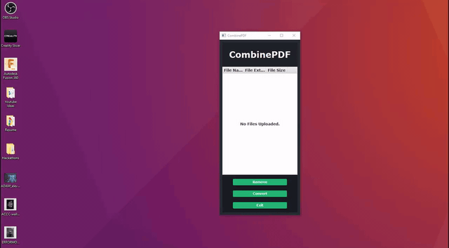

 

  

  <h3 align="center">CombinePDF</h3>

  

    A lightweight simplistic PDF combiner, coded in Java using the MVC architecture in JavaFX.
     
     
    <a href="https://github.com/ShaanCoding/CombinePDF"><strong>Explore the docs »</strong></a>
     
     
    <a href="https://github.com/ShaanCoding/CombinePDF">View Demo</a>
    .
    <a href="https://github.com/ShaanCoding/CombinePDF/issues">Report Bug</a>
    .
    <a href="https://github.com/ShaanCoding/CombinePDF/issues">Request Feature</a>
  

    

## Table Of Contents

- [Table Of Contents](#table-of-contents)
- [About The Project](#about-the-project)
- [Built With](#built-with)
- [Getting Started](#getting-started)
- [Roadmap](#roadmap)
- [Contributing](#contributing)
  - [Creating A Pull Request](#creating-a-pull-request)
- [License](#license)
- [Authors](#authors)
- [Acknowledgements](#acknowledgements)

## About The Project

This project is a simplistic lightweight PDF converter coded in Java. This was made in order to speed up ImageToPDF conversions in a quick, offline and graphical method. This was mainly made in order to speed up the process in which I submit assessment tasks for university.

## Built With

This application was made in Java utilizing base libraries, in addition, this application was also made in tandem with:

* [IText 5.5.0](https://github.com/itext/itextsharp/releases/tag/iTextSharp_5_5_0)

## Getting Started

To use this project just simply download the .jar file and run when needed. To upload images, just drag and drop the selected files and once ready to convert, select the "CONVERT" button.

## Roadmap

See the [open issues](https://github.com/ShaanCoding/CombinePDF/issues) for a list of proposed features (and known issues).

## Contributing

Contributions are what make the open source community such an amazing place to be learn, inspire, and create. Any contributions you make are **greatly appreciated**.
* If you have suggestions for adding or removing projects, feel free to [open an issue](https://github.com/ShaanCoding/CombinePDF/issues/new) to discuss it, or directly create a pull request after you edit the *README.md* file with necessary changes.
* Please make sure you check your spelling and grammar.
* Create individual PR for each suggestion.
* Please also read through the [Code Of Conduct](https://github.com/ShaanCoding/CombinePDF/blob/main/CODE_OF_CONDUCT.md) before posting your first idea as well.

### Creating A Pull Request

1. Fork the Project
2. Create your Feature Branch (`git checkout -b feature/AmazingFeature`)
3. Commit your Changes (`git commit -m 'Add some AmazingFeature'`)
4. Push to the Branch (`git push origin feature/AmazingFeature`)
5. Open a Pull Request

## License

Distributed under the MPL-2.0 License. See [LICENSE](https://github.com/ShaanCoding/CombinePDF/blob/main/LICENSE.md) for more information.

## Authors

* **Shaan Khan** - *Owner* - [Shaan Khan](https://github.com/ShaanCoding/) - *Build everything*

## Acknowledgements

* [ShaanCoding](https://github.com/ShaanCoding/)
* [Othneil Drew](https://github.com/othneildrew/Best-README-Template)
* [ImgShields](https://shields.io/)
